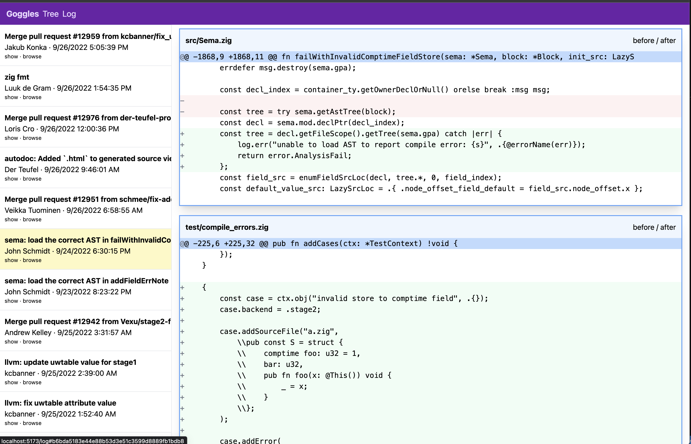

# git-goggles

Browse local git repos in a github-inspired web UI.




```
goggles path/to/repo
```


### Status

Very WIP.  Has barely working screens for:

* Tree view
* Log view (commit history)
* Show blob

Next steps:

* pre-build `goggles` binary for windows, osx, linux (in github actions)
* install instructions
* make it look nicer + work better
  * filter log by author
  * tags, branches, parent and children commit navigation
  * line numbers + syntax highlighting
* improve performance
  * immediatly resolve ref to sha
  * use sha for all subsequent git ops
  * cache git output
  * parse git cli output in golang?

Maybe later:

* package as [wails](https://github.com/wailsapp/wails) app
* run as webserver


### Dev

start go server:

```
go run server.go ~/path/to/repo
```

start vite server:

```
pnpm i
pnpm dev
```

visit http://localhost:5173/


### Build

```
pnpm build
go install
```


### Prior Art

These are much better, use them instead:

terminal uis:

* [tig](https://github.com/jonas/tig)
* [lazygit](https://github.com/jesseduffield/lazygit)
* [gitui](https://github.com/extrawurst/gitui)

electron apps:

* [github desktop](https://github.com/desktop/desktop)
* [git kraken](https://www.gitkraken.com/)